# XMTP Flaunchy Chatbot - System Architecture Documentation

This document provides comprehensive diagrams for all components of the XMTP Flaunchy chatbot system. Each diagram illustrates different aspects of the system architecture to help with debugging, development, and onboarding.

## Table of Contents

1. [Application Initialization & Main Flow](#1-application-initialization--main-flow)
2. [XMTP Status Monitor & Restart Manager](#2-xmtp-status-monitor--restart-manager)
3. [Enhanced Message Coordinator - Message Processing](#3-enhanced-message-coordinator---message-processing)
4. [Enhanced Message Coordinator - Message Filtering](#4-enhanced-message-coordinator---message-filtering)
5. [Flow Router & Intent Classification](#5-flow-router--intent-classification)
6. [User State Management & Storage](#6-user-state-management--storage)
7. [Flow Processing System](#7-flow-processing-system)
8. [Direct Message Handling System](#8-direct-message-handling-system)
9. [Services Architecture & Integration](#9-services-architecture--integration)
10. [Installation Manager & XMTP Client](#10-installation-manager--xmtp-client)
11. [Coin Launch Flow - Detailed Process](#11-coin-launch-flow---detailed-process)
12. [Attachment-Only Message Handling](#12-attachment-only-message-handling)
13. [Complete System Architecture Overview](#13-complete-system-architecture-overview)

---

## 1. Application Initialization & Main Flow

This diagram shows the complete startup process from environment loading to the message processing loop, including XMTP client creation and component initialization.

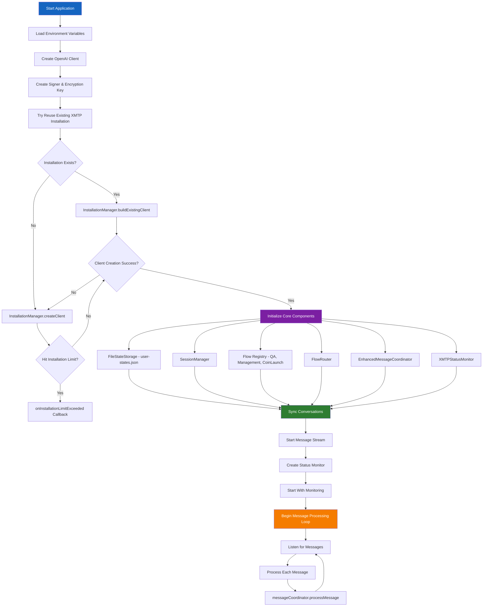

---

## 2. XMTP Status Monitor & Restart Manager

This diagram details the monitoring system that watches the XMTP status page and automatically restarts the application when issues are detected or resolved.

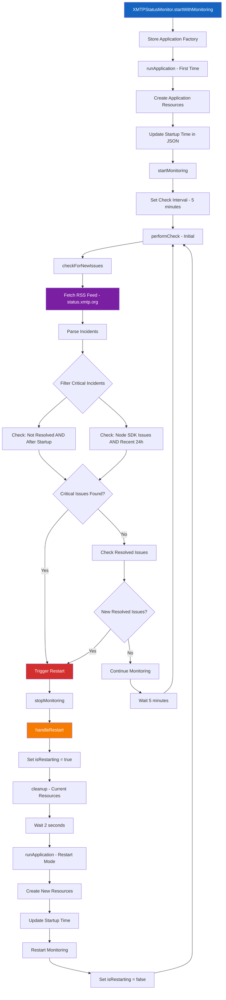

---

## 3. Enhanced Message Coordinator - Message Processing

This diagram illustrates how messages are received, coordinated (text + attachments), and queued for processing with proper timing, including direct message handling and improved transaction reference processing.

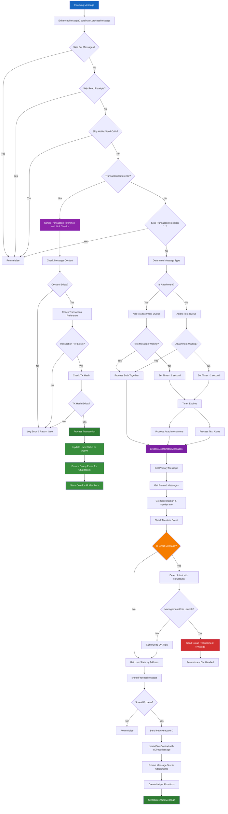

---

## 4. Enhanced Message Coordinator - Message Filtering

This diagram shows the sophisticated filtering system that determines whether to process messages in group chats based on mentions, replies, and active threads.

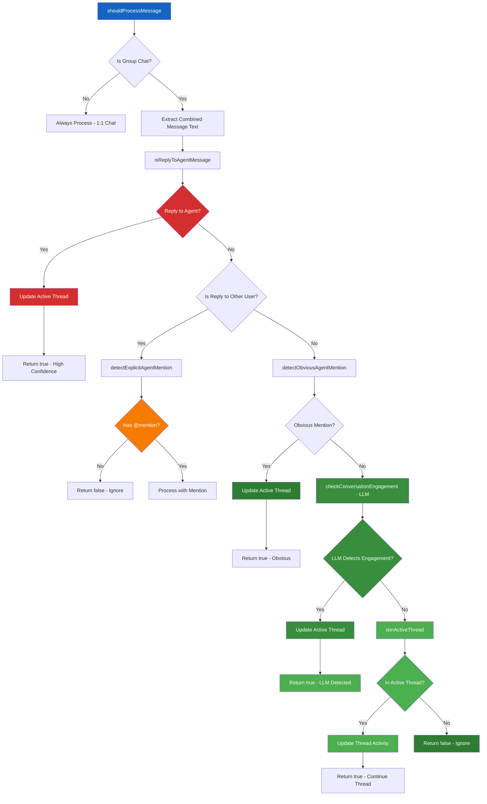

---

## 5. Flow Router & Intent Classification

This diagram documents the updated LLM-based intent classification system that routes messages to appropriate flows based on user intent and context, with priority handling for existing coin launch progress.

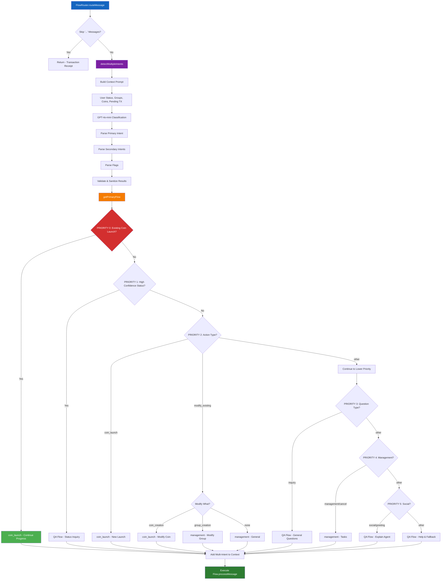

---

## 6. User State Management & Storage

This diagram explains how user data is stored in `user-states.json`, including state creation, updates, multi-user group management, and improved live data injection.

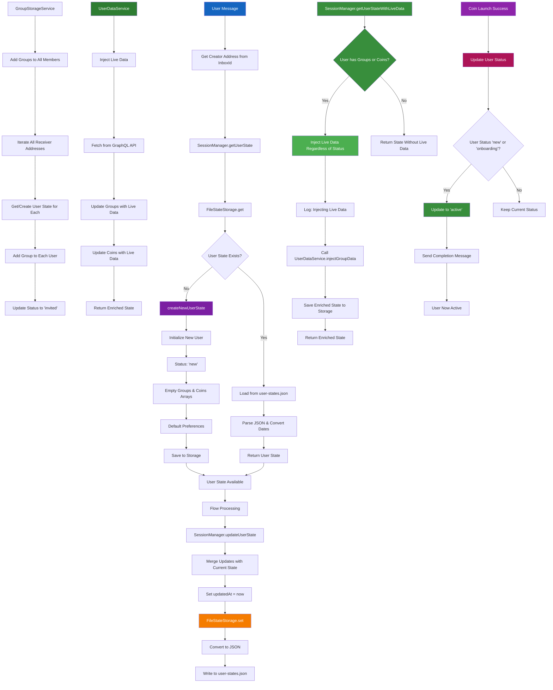

---

## 7. Flow Processing System

This diagram shows how the three main flows (QA, Management, Coin Launch) process different types of user messages and handle various scenarios, with updated QA Flow protection against overriding existing progress.

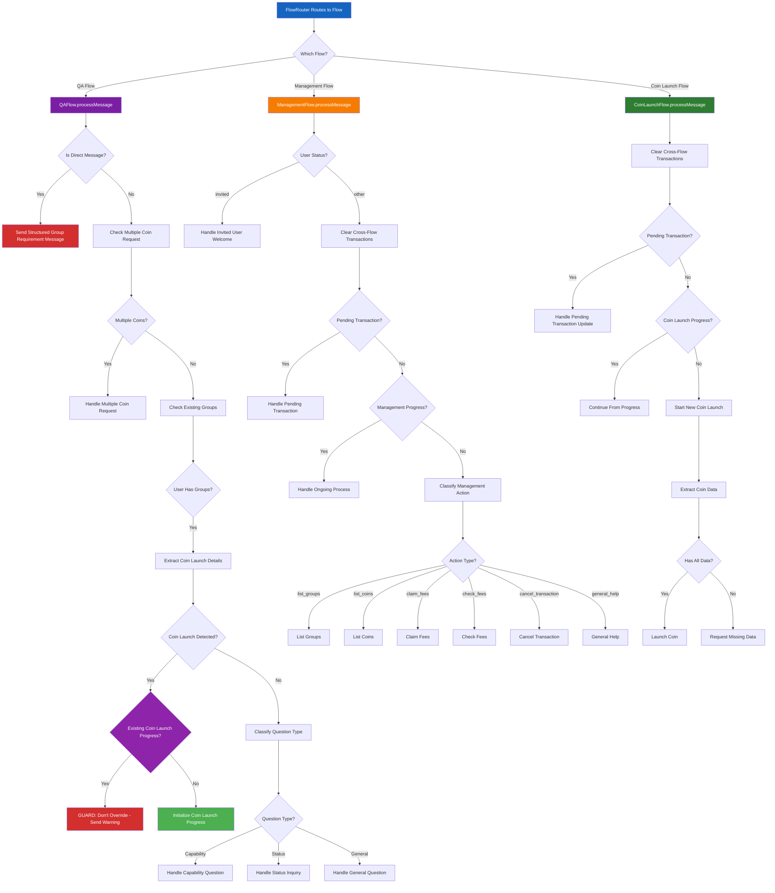

---

## 8. Direct Message Handling System

This diagram shows how the system handles direct messages (1-on-1 conversations) differently from group chats, with smart routing for status inquiries, live data fetching for groups/coins queries, and structured guidance for blocked functionality.

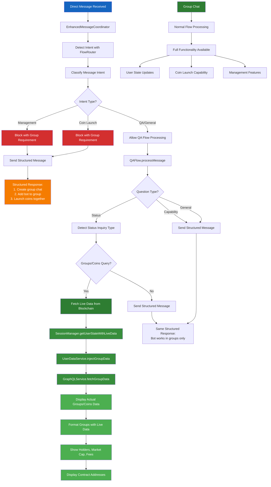

---

## 9. Services Architecture & Integration

This diagram illustrates how all the services (GraphQL, UserData, ENS, GroupStorage, StatusMonitor) work together to provide functionality.

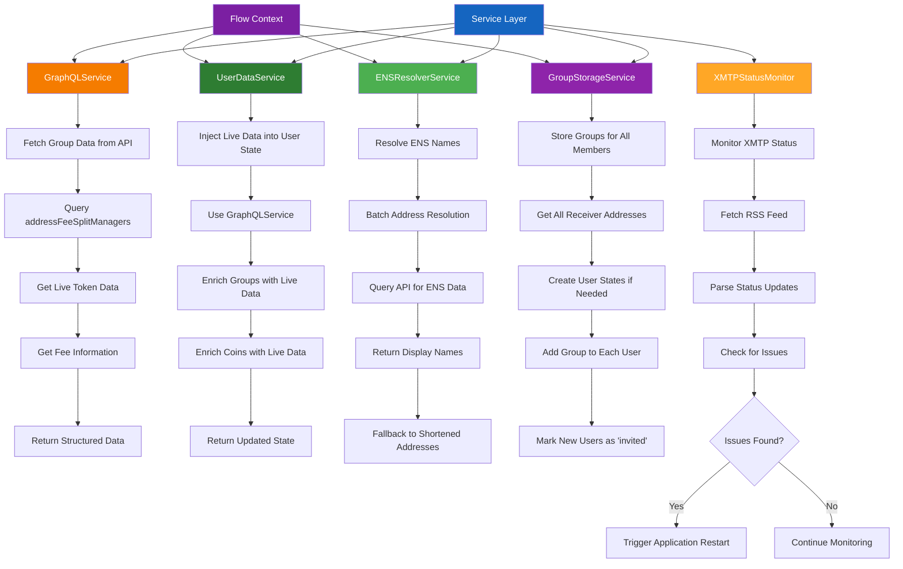

---

## 10. Installation Manager & XMTP Client

This diagram documents the XMTP client creation process, including installation limit handling and retry logic.

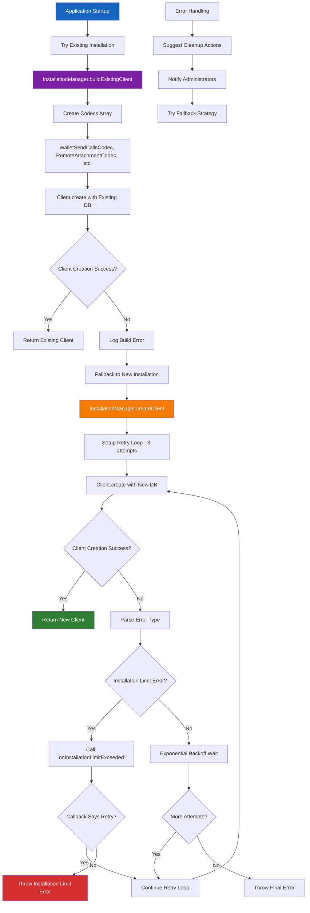

---

## 11. Coin Launch Flow - Detailed Process

This diagram provides a detailed breakdown of the coin launch process, from message extraction to transaction creation, with automatic group creation and proper coin storage for all members.

```mermaid
graph TD
    A[CoinLaunchFlow.processMessage] --> B[Clear Cross-Flow Transactions]
    B --> C{Pending Transaction?}
    C -->|Yes| D[Handle Pending Transaction Update]
    C -->|No| E[Check Inquiry Types]

    E --> F{Launch Options Inquiry?}
    F -->|Yes| G[Handle Launch Options]
    F -->|No| H{Status Inquiry?}
    H -->|Yes| I[Handle Status Inquiry]
    H -->|No| J{Launch Command?}
    J -->|Yes| K[Handle Launch Command]
    J -->|No| L{Coin Launch Progress?}

    L -->|Yes| M[Continue From Progress]
    L -->|No| N[Start New Coin Launch]

    M --> O{SPECIAL CASE: Attachment-Only?}
    O -->|Yes| P[Handle Attachment During Data Collection]
    O -->|No| Q[Extract Coin Data from Message]

    P --> R[Update Image Data: "attachment_provided"]
    R --> S[Send Acknowledgment: "got the image! 📸"]
    S --> T[Check If All Data Complete]
    T --> U{Has Name, Ticker, Image?}
    U -->|Yes| V[Get Manager Info & Launch]
    U -->|No| W[Request Missing Data]

    Q --> X[LLM Extraction using GPT-4o-mini]
    X --> Y[Parse Token Details]
    Y --> Z[Parse Launch Parameters]
    Z --> AA[Validate Extracted Data]

    AA --> BB{Has Name, Ticker, Image?}
    BB -->|Yes| CC[Get Chat Room Manager Address]
    BB -->|No| DD[Request Missing Data]

    CC --> EE{First Launch in Chat?}
    EE -->|Yes| FF[Create Initialize Data]
    EE -->|No| GG[Use Existing Manager]

    FF --> HH[Get All Chat Members]
    HH --> II[Create Fee Split Data]
    II --> JJ[Encode ABI Parameters]

    GG --> KK[Launch Coin]
    JJ --> KK

    KK --> LL[Process Image if Attachment]
    LL --> MM[Upload to IPFS if Needed]
    MM --> NN[Calculate Fee Allocation]
    NN --> OO[Create Flaunch Transaction]

    OO --> PP[Encode Transaction Data]
    PP --> QQ[Set Pending Transaction State]
    QQ --> RR[Send WalletSendCalls]

    RR --> SS[User Signs Transaction]
    SS --> TT[Transaction Success]
    TT --> UU[Extract Manager Address if First Launch]
    UU --> VV[Update User Status to Active]
    VV --> WW[Ensure Group Exists for Chat Room]
    WW --> XX[Store Coin in All Group Members]
    XX --> YY[Update User States]
    YY --> ZZ[Clear Progress & Pending TX]

    N --> AAA[Extract Coin Data from Message]
    AAA --> BBB[Check If Complete]
    BBB --> CCC{Has All Data?}
    CCC -->|Yes| CC
    CCC -->|No| DD

    style A fill:#1565C0,color:#ffffff
    style O fill:#8E24AA,color:#ffffff
    style P fill:#D32F2F,color:#ffffff
    style R fill:#4CAF50,color:#ffffff
    style S fill:#4CAF50,color:#ffffff
    style T fill:#4CAF50,color:#ffffff
    style N fill:#7B1FA2,color:#ffffff
    style CC fill:#2E7D32,color:#ffffff
    style KK fill:#4CAF50,color:#ffffff
    style RR fill:#4CAF50,color:#ffffff
    style UU fill:#388E3C,color:#ffffff
    style VV fill:#388E3C,color:#ffffff
    style WW fill:#4CAF50,color:#ffffff
    style XX fill:#4CAF50,color:#ffffff
    style YY fill:#4CAF50,color:#ffffff
```

---

## 12. Attachment-Only Message Handling

This diagram shows the comprehensive fix for handling attachment-only messages during coin launch data collection, with dual-layer protection to prevent data loss.

```mermaid
graph TD
    A[User Sends Attachment-Only Message] --> B[EnhancedMessageCoordinator]
    B --> C[Message Queued & Processed]
    C --> D[Extract Combined Text - Empty/Minimal]
    D --> E[Route to FlowRouter]

    E --> F[FlowRouter.getPrimaryFlow]
    F --> G{PRIORITY 0: Existing Coin Launch Progress?}
    G -->|Yes| H[🛡️ PROTECTION LAYER 1]
    G -->|No| I[LLM Intent Classification]

    H --> J[Route to coin_launch Flow]
    J --> K[CoinLaunchFlow.processMessage]

    I --> L[Classified as "other" intent]
    L --> M[Route to qa Flow]
    M --> N[QAFlow.processMessage]

    N --> O[Extract Coin Launch Details]
    O --> P{Coin Launch Detected?}
    P -->|Yes| Q{🛡️ PROTECTION LAYER 2: Existing Progress?}
    P -->|No| R[Handle as General Q&A]

    Q -->|Yes| S[GUARD: Don't Override]
    Q -->|No| T[Create New Progress - BYPASSED]

    S --> U[Send Warning Message]
    U --> V["you already have a coin launch in progress!"]

    K --> W{In collecting_coin_data Step?}
    W -->|Yes| X{Attachment-Only Message?}
    W -->|No| Y[Normal Processing]

    X -->|Yes| Z[🎯 SPECIAL CASE HANDLER]
    X -->|No| AA[Extract Data from Text]

    Z --> BB[Update Image: "attachment_provided"]
    BB --> CC[Send Acknowledgment: "got the image! 📸"]
    CC --> DD[Check Data Completeness]

    DD --> EE{Has Name, Ticker, Image?}
    EE -->|Yes| FF[Launch Coin with Preserved Data]
    EE -->|No| GG[Request Missing Data]

    FF --> HH[✅ Success: Data Preserved]
    GG --> II[Continue Data Collection]

    style A fill:#1565C0,color:#ffffff
    style H fill:#D32F2F,color:#ffffff
    style J fill:#4CAF50,color:#ffffff
    style Q fill:#8E24AA,color:#ffffff
    style S fill:#D32F2F,color:#ffffff
    style V fill:#F57C00,color:#ffffff
    style Z fill:#2E7D32,color:#ffffff
    style BB fill:#4CAF50,color:#ffffff
    style CC fill:#4CAF50,color:#ffffff
    style FF fill:#388E3C,color:#ffffff
    style HH fill:#4CAF50,color:#ffffff
```

---

## 13. Complete System Architecture Overview

This diagram shows the overall system architecture and how all components interact with each other, including the updated flow routing priorities.

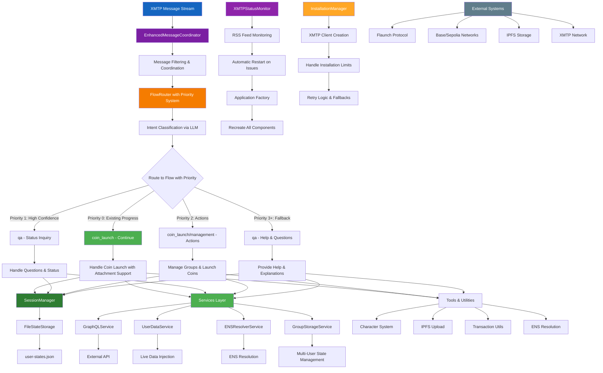

---

## Key System Features

### Message Coordination

- **1-second wait time** to coordinate text + image messages
- **Smart queuing** system for related messages
- **Automatic retry** logic for failed coordination
- **Attachment-only message handling** with dual-layer protection

### Smart Filtering

- Only responds in group chats when **explicitly mentioned** or in **active threads**
- **LLM-powered engagement detection** for edge cases
- **Thread timeout management** (5 minutes of inactivity)

### Priority-Based Flow Routing

- **Priority 0 (HIGHEST)**: Continue existing coin launch progress
- **Priority 1**: High-confidence status inquiries
- **Priority 2**: Action intents (coin launch, modifications)
- **Priority 3+**: Questions, management, social, fallback

### Attachment-Only Message Protection

- **FlowRouter Priority Check**: Routes to coin_launch flow when existing progress exists
- **QAFlow Guard Clause**: Prevents overriding existing coin launch progress
- **Special Case Handler**: Processes attachment-only messages during data collection
- **Data Preservation**: Maintains existing name/ticker when adding image

### Direct Message Handling

- **Smart flow-based routing** for 1-on-1 conversations
- **QA Flow messages** (greetings, questions, help) are allowed but provide structured guidance
- **Groups/Coins status queries** in DMs now fetch and display real live data from GraphQL API with holders, market cap, fees, and contract addresses
- **Management and Coin Launch flows** are blocked with group requirement message
- **No user state updates** for blocked direct message interactions
- **Consistent structured responses** with clear step-by-step instructions
- **Live data integration** for status inquiries about user's groups and coins

### State Management

- **Persistent user states** stored in `user-states.json`
- **Improved live data injection** from external APIs that works for all users with coins/groups regardless of status
- **Automatic user status updates** from "new" to "active" after successful coin launch
- **Multi-user group management** with automatic state sharing
- **Automatic group creation** for all chat room members during coin launch

### Transaction Processing

- **Enhanced transaction reference handling** with proper null checks and error validation
- **Robust error handling** with detailed logging for debugging
- **Automatic manager address extraction** for first launches
- **Proper coin storage** for all group members after successful launch

### Automatic Restart

- **Monitors XMTP status** via RSS feed every 5 minutes
- **Automatic restart** on critical issues or when issues are resolved
- **Graceful cleanup** and resource management

### Multi-Flow Architecture

- **QA Flow**: Handles questions, explanations, and help requests (with DM awareness and live data for groups/coins queries) + Protection against overriding existing progress
- **Management Flow**: Manages existing groups, coins, and transactions (group chats only)
- **Coin Launch Flow**: Handles new coin creation with automatic group setup and member management (group chats only) + Special attachment-only handling

### Installation Limit Handling

- **Graceful handling** of XMTP's 5-installation limit
- **Retry logic** with exponential backoff
- **Fallback strategies** and error notifications

### Service Integration

- **External API calls** for live data with proper type handling (string to number conversions)
- **ENS resolution** for user-friendly addresses
- **Multi-user management** for group operations
- **IPFS integration** for image storage

## Debugging Guide

When debugging issues, refer to these diagrams to understand:

1. **Message not being processed**: Check diagram #4 (Message Filtering)
2. **Flow routing issues**: Check diagram #5 (Flow Router & Intent Classification)
3. **State persistence problems**: Check diagram #6 (User State Management)
4. **Restart/connection issues**: Check diagram #2 (Status Monitor)
5. **Transaction handling**: Check diagram #11 (Coin Launch Flow) and #3 (Transaction Reference Processing)
6. **Direct message handling**: Check diagram #8 (Direct Message Handling System)
7. **QA Flow responses in DMs**: Check diagram #7 (Flow Processing System) and #8 (Direct Message Handling)
8. **Attachment-only message issues**: Check diagram #12 (Attachment-Only Message Handling)

### Attachment-Only Message Debugging

- **Attachment routed to wrong flow**: Check FlowRouter priority 0 check for existing coinLaunchProgress
- **Existing progress overridden**: Check QAFlow guard clause protection layer
- **Image not processed during collection**: Check CoinLaunchFlow special case handler
- **Data loss (name/ticker cleared)**: Verify both protection layers are working and no bypass occurred
- **User state corruption**: Check if attachment processing preserves existing coinData
- **Flow routing bypassed**: Verify FlowRouter.getPrimaryFlow priority 0 logic

### Flow Router Priority Debugging

- **Priority 0 not working**: Check if groupState.coinLaunchProgress exists
- **Wrong priority triggered**: Verify LLM intent classification and confidence levels
- **Flow routing inconsistent**: Check priority order and fallback logic
- **Intent classification failing**: Verify LLM prompt and response parsing

### Coin Launch Progress Debugging

- **Progress not continuing**: Check if existing coinLaunchProgress is detected
- **Data collection step stuck**: Verify attachment-only special case handler
- **Missing data not requested**: Check requestMissingData logic
- **Transaction not created**: Verify all required data is present

### User State Management Debugging

- **Status stuck at "new"**: Check if coin launch success triggers status update to "active"
- **Groups not appearing**: Verify automatic group creation during coin launch
- **Coins missing after launch**: Check if `addCoinToAllGroupMembers` is being called
- **Live data not persisting**: Verify enriched state is being saved back to storage
- **Progress state corrupted**: Check if coinLaunchProgress is being properly updated

Each diagram provides the logical flow to trace through when investigating specific types of issues. The new attachment-only message handling system provides comprehensive protection against data loss during coin launch data collection.
