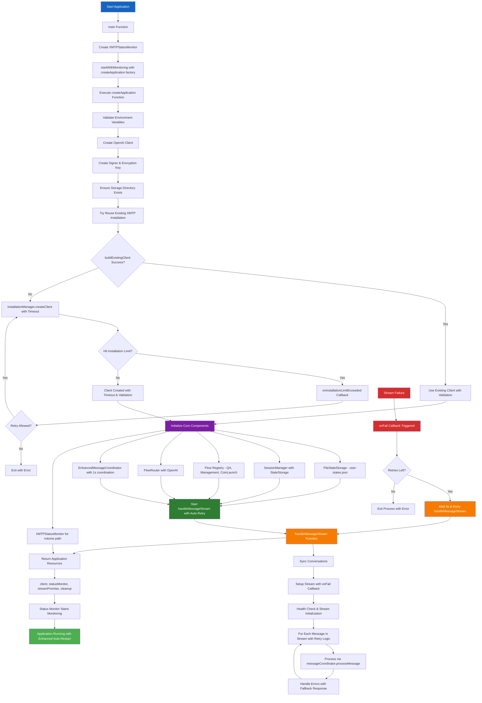
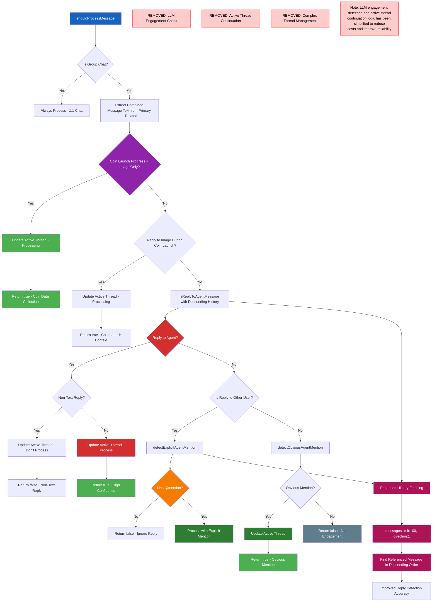
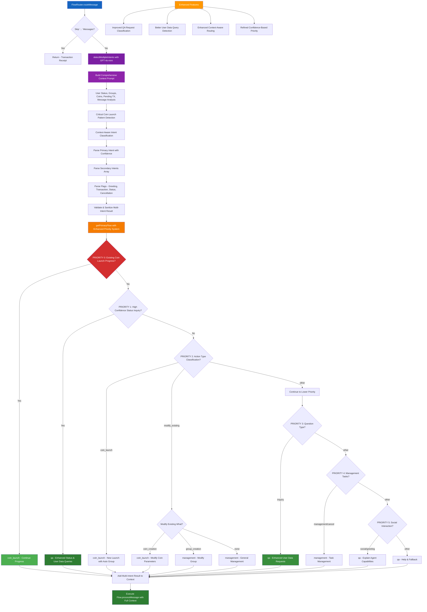
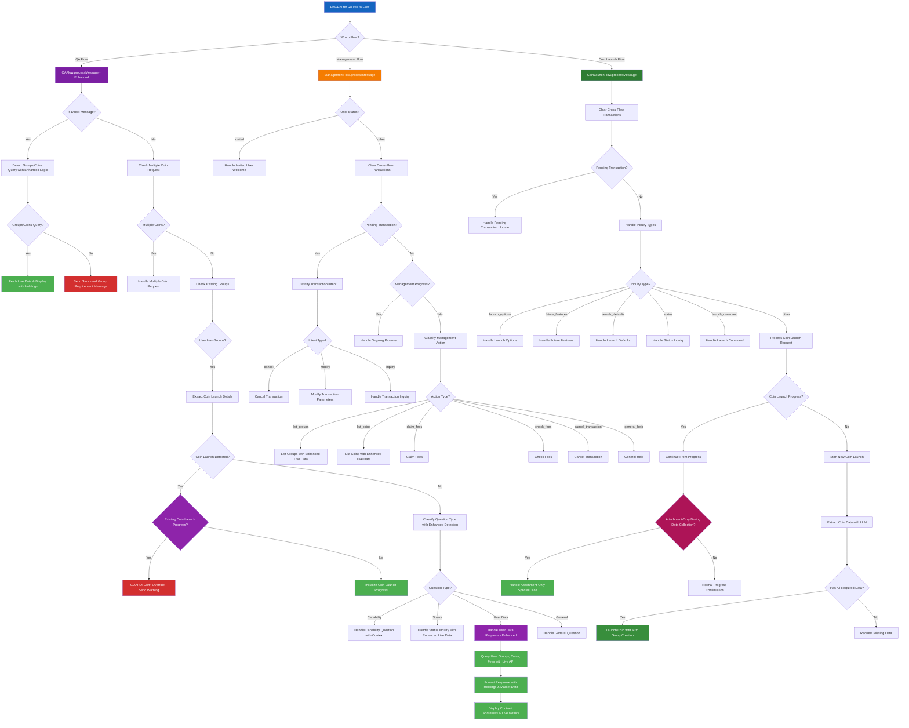
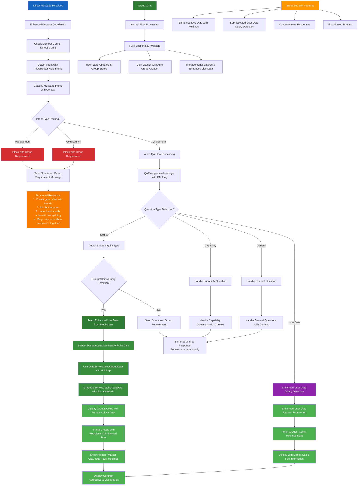
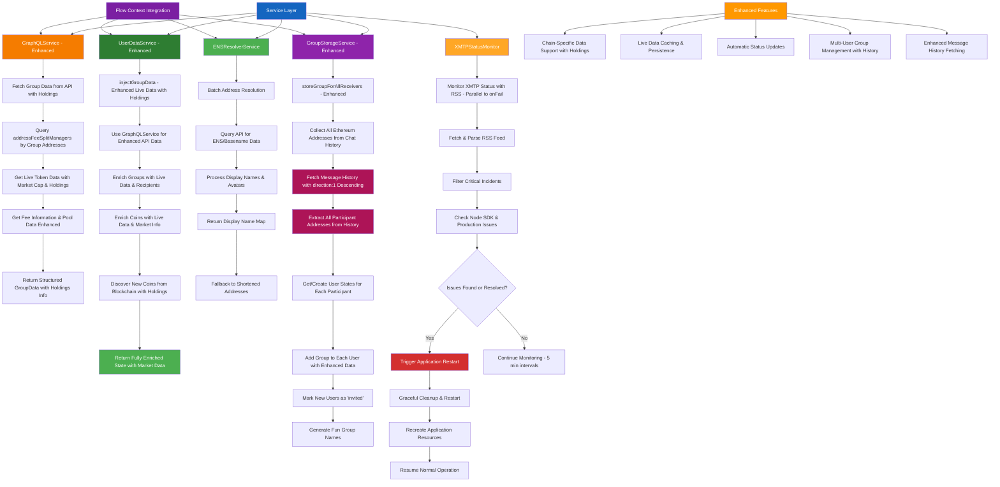
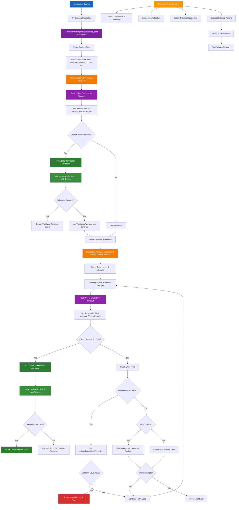

# XMTP Flaunchy Chatbot - System Architecture Documentation

This document provides comprehensive diagrams for all components of the XMTP Flaunchy chatbot system. Each diagram illustrates different aspects of the system architecture to help with debugging, development, and onboarding.

## Table of Contents

1. [Application Initialization & Main Flow](#1-application-initialization--main-flow)
2. [XMTP Stream Auto-Restart & Failure Handling](#2-xmtp-stream-auto-restart--failure-handling)
3. [Enhanced Message Coordinator - Message Processing](#3-enhanced-message-coordinator---message-processing)
4. [Enhanced Message Coordinator - Message Filtering](#4-enhanced-message-coordinator---message-filtering)
5. [Flow Router & Intent Classification](#5-flow-router--intent-classification)
6. [User State Management & Storage](#6-user-state-management--storage)
7. [Flow Processing System](#7-flow-processing-system)
8. [Direct Message Handling System](#8-direct-message-handling-system)
9. [Services Architecture & Integration](#9-services-architecture--integration)
10. [Installation Manager & XMTP Client](#10-installation-manager--xmtp-client)
11. [Coin Launch Flow - Detailed Process](#11-coin-launch-flow---detailed-process)
12. [Attachment-Only Message Handling](#12-attachment-only-message-handling)
13. [Complete System Architecture Overview](#13-complete-system-architecture-overview)

---

## 1. Application Initialization & Main Flow

This diagram shows the complete startup process from environment loading to the message processing loop, including XMTP client creation and component initialization with enhanced monitoring and stream failure handling.



---

## 2. XMTP Stream Auto-Restart & Failure Handling

This diagram details the enhanced stream monitoring system with XMTP's onFail callback and automatic retry logic, replacing the previous status page monitoring approach with native XMTP failure detection.

```mermaid
graph TD
    A[handleMessageStream Start] --> B[Initialize Stream Retry Configuration]
    B --> C[MAX_STREAM_RETRIES = 5, RETRY_INTERVAL = 5s]
    C --> D[Setup onFail Callback Handler]

    D --> E[Sync Conversations with Timing]
    E --> F[Setup Stream with onFail Callback]
    F --> G[streamAllMessages with onFail Parameter]

    G --> H[XMTP Connection Health Check]
    H --> I[conversations.list limit:1 with Timing]
    I --> J[1s Stream Initialization Delay]
    J --> K[Reset Retry Count to MAX_STREAM_RETRIES]

    K --> L[Start Message Processing Loop]
    L --> M[for await message of stream]
    M --> N{Message Received?}
    N -->|Yes| O[Process via messageCoordinator]
    N -->|No| P[Continue Loop]

    O --> Q{Processing Error?}
    Q -->|Yes| R[Send Error Response to User]
    Q -->|No| P

    P --> M
    R --> M

    S[XMTP Stream Failure] --> T[onFail Callback Triggered]
    T --> U[Log Stream Failure Error]
    U --> V{isStreamActive?}
    V -->|No| W[Skip Retry - App Shutting Down]
    V -->|Yes| X{Retries Remaining?}

    X -->|Yes| Y[Decrement Retry Count]
    Y --> Z[Wait 5 seconds]
    Z --> AA[Restart handleMessageStream]
    AA --> E

    X -->|No| BB[Log Max Retries Reached]
    BB --> CC[process.exit(1)]

    DD[Graceful Shutdown] --> EE[Set isStreamActive = false]
    EE --> FF[Set streamRetries = 0]
    FF --> GG[Prevent New Retries]

    HH[XMTPStatusMonitor] --> II[RSS Feed Monitoring - Parallel System]
    II --> JJ[5-minute Interval Checks]
    JJ --> KK[Application-Level Restart for Status Issues]

    style A fill:#1565C0,color:#ffffff
    style S fill:#D32F2F,color:#ffffff
    style T fill:#D32F2F,color:#ffffff
    style U fill:#F57C00,color:#ffffff
    style Y fill:#F57C00,color:#ffffff
    style AA fill:#2E7D32,color:#ffffff
    style BB fill:#D32F2F,color:#ffffff
    style CC fill:#D32F2F,color:#ffffff
    style HH fill:#7B1FA2,color:#ffffff
```

---

## 3. Enhanced Message Coordinator - Message Processing

This diagram illustrates how messages are received, coordinated (text + attachments), and queued for processing with proper timing, including direct message handling, improved transaction reference processing, and enhanced message history fetching in descending order.

```mermaid
graph TD
    A[Incoming Message] --> B[EnhancedMessageCoordinator.processMessage]
    B --> C{Skip Bot Messages?}
    C -->|Yes| D[Return false]
    C -->|No| E{Skip Read Receipts?}
    E -->|Yes| D
    E -->|No| F{Skip Wallet Send Calls?}
    F -->|Yes| D
    F -->|No| G{Transaction Reference?}
    G -->|Yes| H[handleTransactionReference with Null Checks]
    G -->|No| I{Skip Transaction Receipts '...'?}
    I -->|Yes| D
    I -->|No| J[Determine Message Type & Queue]

    H --> H1[Validate Message Content & Reference]
    H1 --> H2{Valid TX Hash?}
    H2 -->|No| H3[Log Error & Return false]
    H2 -->|Yes| H4[Get User & Group State]
    H4 --> H5{Pending Transaction?}
    H5 -->|No| H3
    H5 -->|Yes| H6[Process Transaction Receipt]
    H6 --> H7[Extract Contract Address from Receipt]
    H7 --> H8[Update User Status to Active]
    H8 --> H9[Ensure Group Exists for Chat Room]
    H9 --> H10[Store Coin for All Members]
    H10 --> H11[Clear Progress & Pending TX]

    J --> K{Is Attachment?}
    K -->|Yes| L[Add to Attachment Queue]
    K -->|No| M[Add to Text Queue]

    L --> N{Text Message Waiting?}
    N -->|Yes| O[Process Both Together]
    N -->|No| P[Set Timer - 1 second]

    M --> Q{Attachment Waiting?}
    Q -->|Yes| O
    Q -->|No| R[Set Timer - 1 second]

    P --> S[Timer Expires]
    S --> T[Process Attachment Alone]
    R --> S
    S --> U[Process Text Alone]

    O --> V[processCoordinatedMessages]
    T --> V
    U --> V

    V --> W[Get Primary Message & Related Messages]
    W --> X[Get Conversation & Check Member Count]
    X --> Y{Is Direct Message?}
    Y -->|Yes| Z[Detect Intent with FlowRouter]
    Y -->|No| AA[Get User State by Address]

    Z --> BB{Management/Coin Launch Intent?}
    BB -->|Yes| CC[Send Group Requirement Message]
    BB -->|No| DD[Continue to QA Flow Processing]

    CC --> EE[Return true - DM Handled]
    DD --> AA

    AA --> FF[Get Group State & Check Reply Context]
    FF --> GG[shouldProcessMessage with Advanced Filtering]
    GG --> HH{Should Process?}
    HH -->|No| II[Return false]
    HH -->|Yes| JJ[Send Paw Reaction 🐾]

    JJ --> KK[createFlowContext with All Context]
    KK --> LL[Extract Combined Message Text & Attachments]
    LL --> MM[Create Helper Functions & Services]
    MM --> NN[flowRouter.routeMessage with Multi-Intent]

    OO[Enhanced Message History] --> PP[Fetch with direction: 1 - Descending Order]
    PP --> QQ[conversation.messages limit:100, direction:1]
    QQ --> RR[Process Recent Messages First]

    style A fill:#1565C0,color:#ffffff
    style V fill:#7B1FA2,color:#ffffff
    style Y fill:#F57C00,color:#ffffff
    style CC fill:#D32F2F,color:#ffffff
    style H fill:#8E24AA,color:#ffffff
    style H6 fill:#2E7D32,color:#ffffff
    style H8 fill:#388E3C,color:#ffffff
    style H9 fill:#388E3C,color:#ffffff
    style H10 fill:#388E3C,color:#ffffff
    style GG fill:#4CAF50,color:#ffffff
    style NN fill:#2E7D32,color:#ffffff
    style OO fill:#AD1457,color:#ffffff
    style PP fill:#AD1457,color:#ffffff
    style QQ fill:#AD1457,color:#ffffff
```



---

## 4. Enhanced Message Coordinator - Message Filtering

This diagram shows the sophisticated filtering system that determines whether to process messages in group chats based on mentions, replies, active threads, and special coin launch contexts, with improved message history handling.



---

## 5. Flow Router & Intent Classification

This diagram documents the updated LLM-based intent classification system that routes messages to appropriate flows based on user intent and context, with sophisticated multi-intent detection and priority-based routing, enhanced for better QA request handling.



---

## 6. User State Management & Storage

This diagram explains how user data is stored in `user-states.json`, including state creation, updates, multi-user group management, group-specific states, advanced live data injection, and enhanced group recipient data storage.

```mermaid
graph TD
    A[User Message] --> B[Get Creator Address from InboxId]
    B --> C[SessionManager.getUserState]

    C --> D[FileStateStorage.get]
    D --> E{User State Exists?}
    E -->|No| F[createNewUserState]
    E -->|Yes| G[Load from user-states.json with Date Parsing]

    F --> H[Initialize New User]
    H --> I[Status: 'new']
    I --> J[Empty Groups & Coins Arrays]
    J --> K[Empty GroupStates Object]
    K --> L[Default Preferences]
    L --> M[Save to Storage]

    G --> N[Parse JSON & Convert Date Objects]
    N --> O[Return User State with GroupStates]

    M --> P[User State Available]
    O --> P

    P --> Q[Flow Processing Requires Group State]
    Q --> R[SessionManager.getGroupState]
    R --> S[Extract Group-Specific State]
    S --> T[Return GroupState for Conversation]

    U[Flow Updates Group State] --> V[SessionManager.updateGroupState]
    V --> W[Merge Updates with Group-Specific State]
    W --> X[Update User.groupStates[groupId]]
    X --> Y[Set updatedAt = now]
    Y --> Z[FileStateStorage.set]

    Z --> AA[Convert to JSON with Date Serialization]
    AA --> BB[Write to user-states.json]

    CC[Enhanced GroupStorageService] --> DD[storeGroupForAllReceivers]
    DD --> EE[Collect All Ethereum Addresses from Chat]
    EE --> FF[Fetch Message History for All Participants]
    FF --> GG[Extract Participant Addresses from History]
    GG --> HH[Iterate All Receiver Addresses]
    HH --> II[Get/Create User State for Each Address]
    II --> JJ[Check if User Existed Before]
    JJ --> KK{User Existed Before?}
    KK -->|No| LL[Mark as 'invited']
    KK -->|Yes| MM[Keep Current Status]
    LL --> NN[Add Group to User with Enhanced Data]
    MM --> NN

    OO[UserDataService] --> PP[injectGroupData with Enhanced API]
    PP --> QQ[Fetch from GraphQL API with Holdings]
    QQ --> RR[Update Groups with Live Data]
    RR --> SS[Update Coins with Live Data]
    SS --> TT[Discover New Coins from API]
    TT --> UU[Return Enriched State]

    VV[SessionManager.getUserStateWithLiveData] --> WW{User has Groups or Coins?}
    WW -->|Yes| XX[Inject Live Data for All Users]
    WW -->|No| YY[Return State Without Live Data]

    XX --> ZZ[Call UserDataService.injectGroupData]
    ZZ --> AAA[Save Enriched State to Storage]
    AAA --> BBB[Return Enriched State]

    CCC[Coin Launch Success] --> DDD[Update User Status]
    DDD --> EEE{User Status 'new' or 'onboarding'?}
    EEE -->|Yes| FFF[Update to 'active']
    EEE -->|No| GGG[Keep Current Status]

    FFF --> HHH[Clear Progress & Pending TX]
    HHH --> III[User Now Active]

    style A fill:#1565C0,color:#ffffff
    style F fill:#7B1FA2,color:#ffffff
    style K fill:#8E24AA,color:#ffffff
    style Z fill:#F57C00,color:#ffffff
    style CC fill:#2E7D32,color:#ffffff
    style DD fill:#388E3C,color:#ffffff
    style FF fill:#4CAF50,color:#ffffff
    style GG fill:#4CAF50,color:#ffffff
    style OO fill:#2E7D32,color:#ffffff
    style VV fill:#388E3C,color:#ffffff
    style WW fill:#388E3C,color:#ffffff
    style XX fill:#4CAF50,color:#ffffff
    style CCC fill:#8E24AA,color:#ffffff
    style DDD fill:#AD1457,color:#ffffff
    style FFF fill:#388E3C,color:#ffffff
```

---

## 7. Flow Processing System

This diagram shows how the three main flows (QA, Management, Coin Launch) process different types of user messages and handle various scenarios, with sophisticated direct message handling, advanced state management, and enhanced QA request processing for user data.



---

## 8. Direct Message Handling System

This diagram shows how the system handles direct messages (1-on-1 conversations) differently from group chats, with sophisticated intent detection, enhanced live data fetching for groups/coins queries, and structured guidance for blocked functionality.



---

## 9. Services Architecture & Integration

This diagram illustrates how all the services (GraphQL, UserData, ENS, GroupStorage, StatusMonitor) work together to provide functionality with sophisticated integration patterns and enhanced data handling.



---

## 10. Installation Manager & XMTP Client

This diagram documents the enhanced XMTP client creation process, including installation limit handling, retry logic, timeout handling, and immediate connection validation.



---

## 11. Coin Launch Flow - Detailed Process

This diagram provides a detailed breakdown of the coin launch process, from message extraction to transaction creation, with automatic group creation, proper coin storage for all members, and enhanced confirmation text with receiver lists.

```mermaid
graph TD
    A[CoinLaunchFlow.processMessage] --> B[Clear Cross-Flow Transactions]
    B --> C{Pending Transaction?}
    C -->|Yes| D[Handle Pending Transaction Update]
    C -->|No| E[Check Inquiry Types]

    E --> F{Launch Options Inquiry?}
    F -->|Yes| G[Handle Launch Options]
    F -->|No| H{Status Inquiry?}
    H -->|Yes| I[Handle Status Inquiry]
    H -->|No| J{Launch Command?}
    J -->|Yes| K[Handle Launch Command]
    J -->|No| L{Coin Launch Progress?}

    L -->|Yes| M[Continue From Progress]
    L -->|No| N[Start New Coin Launch]

    M --> O{SPECIAL CASE: Attachment-Only?}
    O -->|Yes| P[Handle Attachment During Data Collection]
    O -->|No| Q[Extract Coin Data from Message]

    P --> R[Update Image Data: "attachment_provided"]
    R --> S[Send Acknowledgment: "got the image! 📸"]
    S --> T[Check If All Data Complete]
    T --> U{Has Name, Ticker, Image?}
    U -->|Yes| V[Get Manager Info & Launch]
    U -->|No| W[Request Missing Data]

    Q --> X[LLM Extraction using GPT-4o-mini]
    X --> Y[Parse Token Details]
    Y --> Z[Parse Launch Parameters]
    Z --> AA[Validate Extracted Data]

    AA --> BB{Has Name, Ticker, Image?}
    BB -->|Yes| CC[Get Chat Room Manager Address]
    BB -->|No| DD[Request Missing Data]

    CC --> EE{First Launch in Chat?}
    EE -->|Yes| FF[Create Initialize Data]
    EE -->|No| GG[Use Existing Manager]

    FF --> HH[Get All Chat Members with Enhanced History]
    HH --> II[Fetch Message History direction:1 Descending]
    II --> JJ[Extract All Participant Addresses]
    JJ --> KK[Create Fee Split Data for All Participants]
    KK --> LL[Encode ABI Parameters]

    GG --> MM[Launch Coin]
    LL --> MM

    MM --> NN[Process Image if Attachment]
    NN --> OO[Upload to IPFS if Needed]
    OO --> PP[Calculate Fee Allocation]
    PP --> QQ[Create Flaunch Transaction]

    QQ --> RR[Encode Transaction Data]
    RR --> SS[Set Pending Transaction State]
    SS --> TT[Send WalletSendCalls]

    TT --> UU[User Signs Transaction]
    UU --> VV[Transaction Success]
    VV --> WW[Extract Manager Address if First Launch]
    WW --> XX[Update User Status to Active]
    XX --> YY[Ensure Group Exists for Chat Room]
    YY --> ZZ[Store Coin in All Group Members with Enhanced Data]
    ZZ --> AAA[Send Enhanced Confirmation with Receiver List]
    AAA --> BBB[Format Receivers with Display Names]
    BBB --> CCC[Show Fee Distribution Information]
    CCC --> DDD[Update User States]
    DDD --> EEE[Clear Progress & Pending TX]

    N --> GGG[Extract Coin Data from Message]
    GGG --> HHH[Check If Complete]
    HHH --> III{Has All Data?}
    III -->|Yes| CC
    III -->|No| DD

    style A fill:#1565C0,color:#ffffff
    style O fill:#8E24AA,color:#ffffff
    style P fill:#D32F2F,color:#ffffff
    style R fill:#4CAF50,color:#ffffff
    style S fill:#4CAF50,color:#ffffff
    style T fill:#4CAF50,color:#ffffff
    style N fill:#7B1FA2,color:#ffffff
    style CC fill:#2E7D32,color:#ffffff
    style II fill:#AD1457,color:#ffffff
    style JJ fill:#AD1457,color:#ffffff
    style MM fill:#4CAF50,color:#ffffff
    style TT fill:#4CAF50,color:#ffffff
    style WW fill:#388E3C,color:#ffffff
    style XX fill:#388E3C,color:#ffffff
    style YY fill:#4CAF50,color:#ffffff
    style ZZ fill:#4CAF50,color:#ffffff
    style AAA fill:#2E7D32,color:#ffffff
    style BBB fill:#2E7D32,color:#ffffff
    style CCC fill:#2E7D32,color:#ffffff
    style DDD fill:#4CAF50,color:#ffffff
```

---

## 12. Attachment-Only Message Handling

This diagram shows the comprehensive fix for handling attachment-only messages during coin launch data collection, with dual-layer protection to prevent data loss and enhanced validation.

```mermaid
graph TD
    A[User Sends Attachment-Only Message] --> B[EnhancedMessageCoordinator]
    B --> C[Message Queued & Processed]
    C --> D[Extract Combined Text - Empty/Minimal]
    D --> E[Route to FlowRouter]

    E --> F[FlowRouter.getPrimaryFlow]
    F --> G{PRIORITY 0: Existing Coin Launch Progress?}
    G -->|Yes| H[🛡️ PROTECTION LAYER 1]
    G -->|No| I[LLM Intent Classification]

    H --> J[Route to coin_launch Flow]
    J --> K[CoinLaunchFlow.processMessage]

    I --> L[Classified as "other" intent]
    L --> M[Route to qa Flow]
    M --> N[QAFlow.processMessage]

    N --> O[Extract Coin Launch Details]
    O --> P{Coin Launch Detected?}
    P -->|Yes| Q{🛡️ PROTECTION LAYER 2: Existing Progress?}
    P -->|No| R[Handle as General Q&A]

    Q -->|Yes| S[GUARD: Don't Override]
    Q -->|No| T[Create New Progress - BYPASSED]

    S --> U[Send Warning Message]
    U --> V["you already have a coin launch in progress!"]

    K --> W{In collecting_coin_data Step?}
    W -->|Yes| X{Attachment-Only Message?}
    W -->|No| Y[Normal Processing]

    X -->|Yes| Z[🎯 SPECIAL CASE HANDLER]
    X -->|No| AA[Extract Data from Text]

    Z --> BB[Update Image: "attachment_provided"]
    BB --> CC[Send Acknowledgment: "got the image! 📸"]
    CC --> DD[Check Data Completeness with Validation]

    DD --> EE{Has Name, Ticker, Image?}
    EE -->|Yes| FF[Launch Coin with Preserved Data]
    EE -->|No| GG[Request Missing Data]

    FF --> HH[✅ Success: Data Preserved & Enhanced]
    GG --> II[Continue Data Collection]

    style A fill:#1565C0,color:#ffffff
    style H fill:#D32F2F,color:#ffffff
    style J fill:#4CAF50,color:#ffffff
    style Q fill:#8E24AA,color:#ffffff
    style S fill:#D32F2F,color:#ffffff
    style V fill:#F57C00,color:#ffffff
    style Z fill:#2E7D32,color:#ffffff
    style BB fill:#4CAF50,color:#ffffff
    style CC fill:#4CAF50,color:#ffffff
    style DD fill:#8E24AA,color:#ffffff
    style FF fill:#388E3C,color:#ffffff
    style HH fill:#4CAF50,color:#ffffff
```

---

## 13. Complete System Architecture Overview

This diagram shows the overall system architecture and how all components interact with each other, including the sophisticated multi-intent detection, group-specific state management, enhanced service integration, XMTP stream auto-restart, and improved data handling.

```mermaid
graph TD
    A[XMTP Message Stream] --> B[Enhanced Stream Handling with onFail Auto-Restart]
    B --> C[EnhancedMessageCoordinator with 1s Coordination]
    C --> D[Message Filtering & Coordination with Enhanced History]
    D --> E[FlowRouter with Multi-Intent Detection]
    E --> F[GPT-4o-mini Intent Classification]
    F --> G{Route to Flow with Enhanced Priority System}

    G -->|Priority 0: Existing Progress| H[coin_launch - Continue with Attachment Support]
    G -->|Priority 1: High Confidence| I[qa - Enhanced Status & User Data Queries]
    G -->|Priority 2: Actions| J[coin_launch/management - Actions with Auto Group]
    G -->|Priority 3+: Fallback| K[qa - Help & Questions with Enhanced DM Handling]

    H --> L[Handle Coin Launch with LLM Extraction]
    I --> M[Handle Questions & Enhanced Live Data with Holdings]
    J --> N[Manage Groups & Launch Coins with Auto Creation]
    K --> O[Provide Help & Explanations with Context]

    P[SessionManager with Group States] --> Q[FileStateStorage with Date Handling]
    Q --> R[user-states.json with Enhanced GroupStates]

    S[Enhanced Services Layer] --> T[GraphQLService - Enhanced with Holdings]
    S --> U[UserDataService - Enhanced Live Data Injection]
    S --> V[ENSResolverService - Batch Resolution]
    S --> W[GroupStorageService - Enhanced Multi-User with History]

    T --> X[External API with Enhanced Holdings Data]
    U --> Y[Enhanced Live Data Injection with Market Info]
    V --> Z[ENS/Basename Resolution with Fallbacks]
    W --> AA[Enhanced Multi-User State with Message History]

    BB[XMTP Stream Auto-Restart] --> CC[handleMessageStream with onFail Callback]
    CC --> DD[MAX_STREAM_RETRIES = 5, 5s Retry Interval]
    DD --> EE[Automatic Restart on Stream Failures]
    EE --> FF[Graceful Shutdown Handling]

    GG[XMTPStatusMonitor] --> HH[RSS Feed Monitoring - Parallel System]
    HH --> II[Application-Level Restart for Status Issues]
    II --> JJ[Application Factory with Resource Management]
    JJ --> KK[Recreate All Components with Enhanced Monitoring]

    LL[Enhanced InstallationManager] --> MM[XMTP Client Creation with Timeout & Validation]
    MM --> NN[Handle Installation Limits with Callbacks]
    NN --> OO[Enhanced Retry Logic & Timeout Handling]
    OO --> PP[Immediate Connection Validation]

    L --> P
    M --> P
    N --> P
    O --> P

    L --> S
    M --> S
    N --> S
    O --> S

    QQ[Tools & Utilities] --> RR[Character System with Context]
    QQ --> SS[IPFS Upload with Error Handling]
    QQ --> TT[Transaction Utils with Flaunch Integration]
    QQ --> UU[ENS Resolution with Caching]

    L --> QQ
    N --> QQ
    O --> QQ

    VV[External Systems] --> WW[Flaunch Protocol with Auto Group Creation]
    VV --> XX[Base/Sepolia Networks with Chain Selection]
    VV --> YY[IPFS Storage with Fallbacks]
    VV --> ZZ[XMTP Network with Enhanced Status Monitoring]

    AAA[Enhanced Features] --> BBB[XMTP Stream Auto-Restart with onFail]
    AAA --> CCC[Enhanced Multi-Intent Detection]
    AAA --> DDD[Enhanced Group-Specific State Management]
    AAA --> EEE[Enhanced Live Data Integration with Holdings]
    AAA --> FFF[Sophisticated Message Coordination]
    AAA --> GGG[Enhanced Direct Message Handling]
    AAA --> HHH[Timeout Handling & Connection Validation]
    AAA --> III[Enhanced Message History with Descending Order]

    style A fill:#1565C0,color:#ffffff
    style B fill:#D32F2F,color:#ffffff
    style C fill:#7B1FA2,color:#ffffff
    style E fill:#F57C00,color:#ffffff
    style H fill:#4CAF50,color:#ffffff
    style I fill:#2E7D32,color:#ffffff
    style P fill:#2E7D32,color:#ffffff
    style S fill:#4CAF50,color:#ffffff
    style BB fill:#8E24AA,color:#ffffff
    style CC fill:#D32F2F,color:#ffffff
    style GG fill:#8E24AA,color:#ffffff
    style LL fill:#FFA726,color:#ffffff
    style VV fill:#607D8B,color:#ffffff
    style AAA fill:#FF9800,color:#ffffff
```



---

## Key System Features

### Enhanced XMTP Stream Auto-Restart

- **Native onFail callback support** from XMTP for immediate failure detection
- **Automatic retry logic** with MAX_STREAM_RETRIES = 5 and 5-second intervals
- **Graceful failure handling** with proper cleanup and resource management
- **Process exit on max retries** to trigger container restart in production
- **Parallel RSS monitoring** for application-level issues alongside stream failures
- **Enhanced startup diagnostics** with timing information and health checks

### Advanced Installation & Client Management

- **Timeout handling** for client creation (30s first attempt, 60s retries)
- **Immediate connection validation** after client creation with timing metrics
- **Enhanced error handling** with timeout detection and detailed diagnostics
- **Installation limit handling** with callbacks and retry logic
- **Connection health checks** with conversations.list validation
- **Enhanced logging** with detailed timing and error information

### Enhanced Message History & Processing

- **Descending order message fetching** (direction: 1) for improved accuracy
- **Enhanced message coordination** with proper timing and attachment handling
- **Improved reply detection** with better message history analysis
- **Enhanced transaction reference processing** with comprehensive null checks
- **Better attachment-only message handling** during coin data collection
- **Advanced message filtering** with special coin launch context awareness

### Enhanced Live Data Integration

- **Holdings data integration** with market cap and fee information
- **Enhanced GraphQL API calls** with chain-specific data support
- **Improved user data query detection** for groups/coins status requests
- **Enhanced live data injection** with automatic coin discovery
- **Better group recipient data storage** with message history analysis
- **Market metrics display** with contract addresses and live data

### Enhanced Flow Processing

- **Improved QA Flow**:

  - Enhanced user data request processing with holdings information
  - Better direct message handling with live data fetching
  - Improved status inquiry responses with market data
  - Enhanced groups/coins query detection and response formatting

- **Enhanced Management Flow**:

  - Better transaction intent classification and handling
  - Enhanced live data integration for listings
  - Improved parameter modification with LLM extraction

- **Enhanced Coin Launch Flow**:
  - Better attachment-only message handling during data collection
  - Enhanced confirmation text with receiver lists and fee distribution
  - Improved group member detection with message history analysis
  - Better coin storage for all group members with enhanced data

### Enhanced Service Integration

- **GraphQLService**: Enhanced with holdings data and market information
- **UserDataService**: Improved live data injection with coin discovery
- **GroupStorageService**: Enhanced with message history analysis for better recipient detection
- **ENSResolverService**: Maintained batch resolution with fallbacks
- **XMTPStatusMonitor**: Parallel monitoring alongside native stream failure handling

### Production-Ready Enhancements

- **Enhanced error handling** with timeout detection and detailed diagnostics
- **Improved logging** with timing metrics and structured debugging information
- **Better performance optimization** with efficient message history fetching
- **Enhanced cost optimization** with strategic LLM usage
- **Robust connection handling** with validation and health checks
- **Better graceful shutdown** with proper resource cleanup
- **Enhanced monitoring** with multiple failure detection mechanisms

## Debugging Guide

When debugging issues, refer to these diagrams to understand:

1. **Stream restart issues**: Check diagram #2 (XMTP Stream Auto-Restart) - examine onFail callback and retry logic
2. **Client creation timeouts**: Check diagram #10 (Installation Manager) - verify timeout handling and validation
3. **Message history problems**: Check diagram #3 (Message Processing) - examine descending order fetching
4. **Enhanced data queries**: Check diagram #8 (Direct Message Handling) - verify live data integration
5. **Group recipient issues**: Check diagram #6 (User State Management) - examine enhanced group storage
6. **Flow routing problems**: Check diagram #5 (Flow Router) - verify enhanced priority system
7. **Attachment handling**: Check diagram #12 (Attachment-Only Messages) - examine special case handling
8. **Complete system flow**: Check diagram #13 (Complete Architecture) - understand enhanced component interactions

### XMTP Stream Debugging

- **Stream not restarting**: Check onFail callback registration and retry count
- **Max retries reached**: Verify MAX_STREAM_RETRIES and process exit logic
- **Graceful shutdown issues**: Check isStreamActive and cleanup handling
- **Health check failures**: Verify connection validation and timeout handling
- **Startup diagnostics**: Check timing metrics and initialization sequence

### Enhanced Data Processing Debugging

- **Holdings data missing**: Check GraphQL API integration and response parsing
- **User data queries failing**: Verify enhanced query detection and live data fetching
- **Message history errors**: Check descending order (direction: 1) parameter
- **Group recipient issues**: Verify message history analysis and address extraction
- **Live data not updating**: Check UserDataService integration and API calls

### Enhanced Flow Debugging

- **QA Flow user data**: Check enhanced detection logic and live data integration
- **Coin launch confirmation**: Verify receiver list formatting and fee distribution
- **Management live data**: Check enhanced GraphQL integration and display formatting
- **Attachment-only handling**: Verify special case detection and data preservation

Each diagram provides the enhanced logical flow to trace through when investigating specific types of issues. The system now includes comprehensive timeout handling, enhanced data integration, better error handling, and improved monitoring capabilities.
