# XMTP Flaunchy Chatbot - System Architecture Documentation

This document provides comprehensive diagrams for all components of the XMTP Flaunchy chatbot system. Each diagram illustrates different aspects of the system architecture to help with debugging, development, and onboarding.

## Table of Contents

1. [Application Initialization & Main Flow](#1-application-initialization--main-flow)
2. [XMTP Status Monitor & Restart Manager](#2-xmtp-status-monitor--restart-manager)
3. [Enhanced Message Coordinator - Message Processing](#3-enhanced-message-coordinator---message-processing)
4. [Enhanced Message Coordinator - Message Filtering](#4-enhanced-message-coordinator---message-filtering)
5. [Flow Router & Intent Classification](#5-flow-router--intent-classification)
6. [User State Management & Storage](#6-user-state-management--storage)
7. [Flow Processing System](#7-flow-processing-system)
8. [Direct Message Handling System](#8-direct-message-handling-system)
9. [Services Architecture & Integration](#9-services-architecture--integration)
10. [Installation Manager & XMTP Client](#10-installation-manager--xmtp-client)
11. [Coin Launch Flow - Detailed Process](#11-coin-launch-flow---detailed-process)
12. [Attachment-Only Message Handling](#12-attachment-only-message-handling)
13. [Complete System Architecture Overview](#13-complete-system-architecture-overview)

---

## 1. Application Initialization & Main Flow

This diagram shows the complete startup process from environment loading to the message processing loop, including XMTP client creation and component initialization with monitoring.


---

## 2. XMTP Status Monitor & Restart Manager

This diagram details the monitoring system that watches the XMTP status page and automatically restarts the application when issues are detected or resolved.


---

## 3. Enhanced Message Coordinator - Message Processing

This diagram illustrates how messages are received, coordinated (text + attachments), and queued for processing with proper timing, including direct message handling and improved transaction reference processing.

```mermaid
graph TD
    A[Incoming Message] --> B[EnhancedMessageCoordinator.processMessage]
    B --> C{Skip Bot Messages?}
    C -->|Yes| D[Return false]
    C -->|No| E{Skip Read Receipts?}
    E -->|Yes| D
    E -->|No| F{Skip Wallet Send Calls?}
    F -->|Yes| D
    F -->|No| G{Transaction Reference?}
    G -->|Yes| H[handleTransactionReference with Null Checks]
    G -->|No| I{Skip Transaction Receipts '...'?}
    I -->|Yes| D
    I -->|No| J[Determine Message Type & Queue]

    H --> H1[Validate Message Content & Reference]
    H1 --> H2{Valid TX Hash?}
    H2 -->|No| H3[Log Error & Return false]
    H2 -->|Yes| H4[Get User & Group State]
    H4 --> H5{Pending Transaction?}
    H5 -->|No| H3
    H5 -->|Yes| H6[Process Transaction Receipt]
    H6 --> H7[Extract Contract Address from Receipt]
    H7 --> H8[Update User Status to Active]
    H8 --> H9[Ensure Group Exists for Chat Room]
    H9 --> H10[Store Coin for All Members]
    H10 --> H11[Clear Progress & Pending TX]

    J --> K{Is Attachment?}
    K -->|Yes| L[Add to Attachment Queue]
    K -->|No| M[Add to Text Queue]

    L --> N{Text Message Waiting?}
    N -->|Yes| O[Process Both Together]
    N -->|No| P[Set Timer - 1 second]

    M --> Q{Attachment Waiting?}
    Q -->|Yes| O
    Q -->|No| R[Set Timer - 1 second]

    P --> S[Timer Expires]
    S --> T[Process Attachment Alone]
    R --> S
    S --> U[Process Text Alone]

    O --> V[processCoordinatedMessages]
    T --> V
    U --> V

    V --> W[Get Primary Message & Related Messages]
    W --> X[Get Conversation & Check Member Count]
    X --> Y{Is Direct Message?}
    Y -->|Yes| Z[Detect Intent with FlowRouter]
    Y -->|No| AA[Get User State by Address]

    Z --> BB{Management/Coin Launch Intent?}
    BB -->|Yes| CC[Send Group Requirement Message]
    BB -->|No| DD[Continue to QA Flow Processing]

    CC --> EE[Return true - DM Handled]
    DD --> AA

    AA --> FF[Get Group State & Check Reply Context]
    FF --> GG[shouldProcessMessage with Advanced Filtering]
    GG --> HH{Should Process?}
    HH -->|No| II[Return false]
    HH -->|Yes| JJ[Send Paw Reaction 🐾]

    JJ --> KK[createFlowContext with All Context]
    KK --> LL[Extract Combined Message Text & Attachments]
    LL --> MM[Create Helper Functions & Services]
    MM --> NN[flowRouter.routeMessage with Multi-Intent]

    style A fill:#1565C0,color:#ffffff
    style V fill:#7B1FA2,color:#ffffff
    style Y fill:#F57C00,color:#ffffff
    style CC fill:#D32F2F,color:#ffffff
    style H fill:#8E24AA,color:#ffffff
    style H6 fill:#2E7D32,color:#ffffff
    style H8 fill:#388E3C,color:#ffffff
    style H9 fill:#388E3C,color:#ffffff
    style H10 fill:#388E3C,color:#ffffff
    style GG fill:#4CAF50,color:#ffffff
    style NN fill:#2E7D32,color:#ffffff
```



---

## 4. Enhanced Message Coordinator - Message Filtering

This diagram shows the sophisticated filtering system that determines whether to process messages in group chats based on mentions, replies, active threads, and special coin launch contexts.


---

## 5. Flow Router & Intent Classification

This diagram documents the updated LLM-based intent classification system that routes messages to appropriate flows based on user intent and context, with sophisticated multi-intent detection and priority-based routing.


---

## 6. User State Management & Storage

This diagram explains how user data is stored in `user-states.json`, including state creation, updates, multi-user group management, group-specific states, and advanced live data injection.

```mermaid
graph TD
    A[User Message] --> B[Get Creator Address from InboxId]
    B --> C[SessionManager.getUserState]

    C --> D[FileStateStorage.get]
    D --> E{User State Exists?}
    E -->|No| F[createNewUserState]
    E -->|Yes| G[Load from user-states.json with Date Parsing]

    F --> H[Initialize New User]
    H --> I[Status: 'new']
    I --> J[Empty Groups & Coins Arrays]
    J --> K[Empty GroupStates Object]
    K --> L[Default Preferences]
    L --> M[Save to Storage]

    G --> N[Parse JSON & Convert Date Objects]
    N --> O[Return User State with GroupStates]

    M --> P[User State Available]
    O --> P

    P --> Q[Flow Processing Requires Group State]
    Q --> R[SessionManager.getGroupState]
    R --> S[Extract Group-Specific State]
    S --> T[Return GroupState for Conversation]

    U[Flow Updates Group State] --> V[SessionManager.updateGroupState]
    V --> W[Merge Updates with Group-Specific State]
    W --> X[Update User.groupStates[groupId]]
    X --> Y[Set updatedAt = now]
    Y --> Z[FileStateStorage.set]

    Z --> AA[Convert to JSON with Date Serialization]
    AA --> BB[Write to user-states.json]

    CC[GroupStorageService] --> DD[storeGroupForAllReceivers]
    DD --> EE[Collect All Ethereum Addresses]
    EE --> FF[Iterate All Receiver Addresses]
    FF --> GG[Get/Create User State for Each Address]
    GG --> HH[Check if User Exists]
    HH --> II{User Existed Before?}
    II -->|No| JJ[Mark as 'invited']
    II -->|Yes| KK[Keep Current Status]
    JJ --> LL[Add Group to User]
    KK --> LL

    MM[UserDataService] --> NN[injectGroupData]
    NN --> OO[Fetch from GraphQL API]
    OO --> PP[Update Groups with Live Data]
    PP --> QQ[Update Coins with Live Data]
    QQ --> RR[Discover New Coins from API]
    RR --> SS[Return Enriched State]

    TT[SessionManager.getUserStateWithLiveData] --> UU{User has Groups or Coins?}
    UU -->|Yes| VV[Inject Live Data for All Users]
    UU -->|No| WW[Return State Without Live Data]

    VV --> XX[Call UserDataService.injectGroupData]
    XX --> YY[Save Enriched State to Storage]
    YY --> ZZ[Return Enriched State]

    AAA[Coin Launch Success] --> BBB[Update User Status]
    BBB --> CCC{User Status 'new' or 'onboarding'?}
    CCC -->|Yes| DDD[Update to 'active']
    CCC -->|No| EEE[Keep Current Status]

    DDD --> FFF[Clear Progress & Pending TX]
    FFF --> GGG[User Now Active]

    style A fill:#1565C0,color:#ffffff
    style F fill:#7B1FA2,color:#ffffff
    style K fill:#8E24AA,color:#ffffff
    style Z fill:#F57C00,color:#ffffff
    style MM fill:#2E7D32,color:#ffffff
    style TT fill:#388E3C,color:#ffffff
    style UU fill:#388E3C,color:#ffffff
    style VV fill:#4CAF50,color:#ffffff
    style AAA fill:#8E24AA,color:#ffffff
    style BBB fill:#AD1457,color:#ffffff
    style DDD fill:#388E3C,color:#ffffff
```

---

## 7. Flow Processing System

This diagram shows how the three main flows (QA, Management, Coin Launch) process different types of user messages and handle various scenarios, with sophisticated direct message handling and advanced state management.


---

## 8. Direct Message Handling System

This diagram shows how the system handles direct messages (1-on-1 conversations) differently from group chats, with sophisticated intent detection, live data fetching for groups/coins queries, and structured guidance for blocked functionality.


---

## 9. Services Architecture & Integration

This diagram illustrates how all the services (GraphQL, UserData, ENS, GroupStorage, StatusMonitor) work together to provide functionality with sophisticated integration patterns.


---

## 10. Installation Manager & XMTP Client

This diagram documents the XMTP client creation process, including installation limit handling and retry logic.


---

## 11. Coin Launch Flow - Detailed Process

This diagram provides a detailed breakdown of the coin launch process, from message extraction to transaction creation, with automatic group creation and proper coin storage for all members.

```mermaid
graph TD
    A[CoinLaunchFlow.processMessage] --> B[Clear Cross-Flow Transactions]
    B --> C{Pending Transaction?}
    C -->|Yes| D[Handle Pending Transaction Update]
    C -->|No| E[Check Inquiry Types]

    E --> F{Launch Options Inquiry?}
    F -->|Yes| G[Handle Launch Options]
    F -->|No| H{Status Inquiry?}
    H -->|Yes| I[Handle Status Inquiry]
    H -->|No| J{Launch Command?}
    J -->|Yes| K[Handle Launch Command]
    J -->|No| L{Coin Launch Progress?}

    L -->|Yes| M[Continue From Progress]
    L -->|No| N[Start New Coin Launch]

    M --> O{SPECIAL CASE: Attachment-Only?}
    O -->|Yes| P[Handle Attachment During Data Collection]
    O -->|No| Q[Extract Coin Data from Message]

    P --> R[Update Image Data: "attachment_provided"]
    R --> S[Send Acknowledgment: "got the image! 📸"]
    S --> T[Check If All Data Complete]
    T --> U{Has Name, Ticker, Image?}
    U -->|Yes| V[Get Manager Info & Launch]
    U -->|No| W[Request Missing Data]

    Q --> X[LLM Extraction using GPT-4o-mini]
    X --> Y[Parse Token Details]
    Y --> Z[Parse Launch Parameters]
    Z --> AA[Validate Extracted Data]

    AA --> BB{Has Name, Ticker, Image?}
    BB -->|Yes| CC[Get Chat Room Manager Address]
    BB -->|No| DD[Request Missing Data]

    CC --> EE{First Launch in Chat?}
    EE -->|Yes| FF[Create Initialize Data]
    EE -->|No| GG[Use Existing Manager]

    FF --> HH[Get All Chat Members]
    HH --> II[Create Fee Split Data]
    II --> JJ[Encode ABI Parameters]

    GG --> KK[Launch Coin]
    JJ --> KK

    KK --> LL[Process Image if Attachment]
    LL --> MM[Upload to IPFS if Needed]
    MM --> NN[Calculate Fee Allocation]
    NN --> OO[Create Flaunch Transaction]

    OO --> PP[Encode Transaction Data]
    PP --> QQ[Set Pending Transaction State]
    QQ --> RR[Send WalletSendCalls]

    RR --> SS[User Signs Transaction]
    SS --> TT[Transaction Success]
    TT --> UU[Extract Manager Address if First Launch]
    UU --> VV[Update User Status to Active]
    VV --> WW[Ensure Group Exists for Chat Room]
    WW --> XX[Store Coin in All Group Members]
    XX --> YY[Update User States]
    YY --> ZZ[Clear Progress & Pending TX]

    N --> AAA[Extract Coin Data from Message]
    AAA --> BBB[Check If Complete]
    BBB --> CCC{Has All Data?}
    CCC -->|Yes| CC
    CCC -->|No| DD

    style A fill:#1565C0,color:#ffffff
    style O fill:#8E24AA,color:#ffffff
    style P fill:#D32F2F,color:#ffffff
    style R fill:#4CAF50,color:#ffffff
    style S fill:#4CAF50,color:#ffffff
    style T fill:#4CAF50,color:#ffffff
    style N fill:#7B1FA2,color:#ffffff
    style CC fill:#2E7D32,color:#ffffff
    style KK fill:#4CAF50,color:#ffffff
    style RR fill:#4CAF50,color:#ffffff
    style UU fill:#388E3C,color:#ffffff
    style VV fill:#388E3C,color:#ffffff
    style WW fill:#4CAF50,color:#ffffff
    style XX fill:#4CAF50,color:#ffffff
    style YY fill:#4CAF50,color:#ffffff
```

---

## 12. Attachment-Only Message Handling

This diagram shows the comprehensive fix for handling attachment-only messages during coin launch data collection, with dual-layer protection to prevent data loss.

```mermaid
graph TD
    A[User Sends Attachment-Only Message] --> B[EnhancedMessageCoordinator]
    B --> C[Message Queued & Processed]
    C --> D[Extract Combined Text - Empty/Minimal]
    D --> E[Route to FlowRouter]

    E --> F[FlowRouter.getPrimaryFlow]
    F --> G{PRIORITY 0: Existing Coin Launch Progress?}
    G -->|Yes| H[🛡️ PROTECTION LAYER 1]
    G -->|No| I[LLM Intent Classification]

    H --> J[Route to coin_launch Flow]
    J --> K[CoinLaunchFlow.processMessage]

    I --> L[Classified as "other" intent]
    L --> M[Route to qa Flow]
    M --> N[QAFlow.processMessage]

    N --> O[Extract Coin Launch Details]
    O --> P{Coin Launch Detected?}
    P -->|Yes| Q{🛡️ PROTECTION LAYER 2: Existing Progress?}
    P -->|No| R[Handle as General Q&A]

    Q -->|Yes| S[GUARD: Don't Override]
    Q -->|No| T[Create New Progress - BYPASSED]

    S --> U[Send Warning Message]
    U --> V["you already have a coin launch in progress!"]

    K --> W{In collecting_coin_data Step?}
    W -->|Yes| X{Attachment-Only Message?}
    W -->|No| Y[Normal Processing]

    X -->|Yes| Z[🎯 SPECIAL CASE HANDLER]
    X -->|No| AA[Extract Data from Text]

    Z --> BB[Update Image: "attachment_provided"]
    BB --> CC[Send Acknowledgment: "got the image! 📸"]
    CC --> DD[Check Data Completeness]

    DD --> EE{Has Name, Ticker, Image?}
    EE -->|Yes| FF[Launch Coin with Preserved Data]
    EE -->|No| GG[Request Missing Data]

    FF --> HH[✅ Success: Data Preserved]
    GG --> II[Continue Data Collection]

    style A fill:#1565C0,color:#ffffff
    style H fill:#D32F2F,color:#ffffff
    style J fill:#4CAF50,color:#ffffff
    style Q fill:#8E24AA,color:#ffffff
    style S fill:#D32F2F,color:#ffffff
    style V fill:#F57C00,color:#ffffff
    style Z fill:#2E7D32,color:#ffffff
    style BB fill:#4CAF50,color:#ffffff
    style CC fill:#4CAF50,color:#ffffff
    style FF fill:#388E3C,color:#ffffff
    style HH fill:#4CAF50,color:#ffffff
```

---

## 13. Complete System Architecture Overview

This diagram shows the overall system architecture and how all components interact with each other, including the sophisticated multi-intent detection, group-specific state management, and enhanced service integration.


---

## Key System Features

### Advanced Message Coordination

- **1-second wait time** to coordinate text + image messages with sophisticated queuing
- **Smart queuing** system for related messages with attachment synchronization
- **Automatic retry** logic for failed coordination with graceful degradation
- **Attachment-only message handling** with dual-layer protection and special case handling
- **Combined message text extraction** from primary and related messages
- **Thread management** with active thread tracking and timeout handling (5 minutes)

### Sophisticated Message Filtering

- **Context-aware filtering** with special handling for coin launch progress
- **Reply detection** with distinction between agent replies and user replies
- **Explicit mention detection** with @-symbol and obvious mention patterns
- **Non-text reply handling** for reactions and other content types
- **Image-only message processing** during coin data collection phases
- **Simplified engagement detection** with cost-effective LLM usage

### Multi-Intent Detection & Priority-Based Routing

- **GPT-4o-mini powered intent classification** with confidence scoring
- **Primary and secondary intent detection** for comprehensive message understanding
- **Critical coin launch pattern recognition** with context-aware classification
- **Priority 0 (HIGHEST)**: Continue existing coin launch progress (attachment support)
- **Priority 1**: High-confidence status inquiries with live data
- **Priority 2**: Action intents (coin launch with auto group, modifications)
- **Priority 3+**: Questions, management, social interactions, fallback handling

### Enhanced Direct Message Handling

- **Smart flow-based routing** for 1-on-1 conversations with intent detection
- **Live data fetching** for groups/coins status queries in DMs
- **Context-aware responses** with structured guidance for group requirements
- **Capability and general question handling** with character voice
- **Management and coin launch flow blocking** with clear instructions
- **No user state updates** for blocked direct message interactions
- **Consistent structured responses** with step-by-step group creation guidance

### Advanced State Management

- **Group-specific state management** with per-conversation state tracking
- **FileStateStorage** with sophisticated date handling and JSON serialization
- **Live data injection** from blockchain APIs for all users with coins/groups
- **Automatic user status updates** from "new" to "active" after successful operations
- **Multi-user group management** with automatic state sharing and invitation handling
- **Coin discovery** from blockchain data with automatic state updates

### Comprehensive Transaction Processing

- **Enhanced transaction reference handling** with comprehensive null checks
- **Robust error handling** with detailed logging and fallback responses
- **Automatic manager address extraction** for first launches in chat rooms
- **Proper coin storage** for all group members after successful launch
- **Transaction modification support** with LLM-powered parameter updates
- **Cross-flow transaction clearing** to prevent state conflicts

### Intelligent Service Integration

- **GraphQLService** with chain-specific data support and holdings information
- **UserDataService** with live data injection and coin discovery from blockchain
- **ENSResolverService** with batch resolution and ENS/Basename support
- **GroupStorageService** with multi-user management and automatic status updates
- **XMTPStatusMonitor** with RSS feed monitoring and automatic restart capabilities

### Enhanced Flow Processing

- **QA Flow**:

  - Direct message handling with live data for groups/coins queries
  - Protection against overriding existing coin launch progress
  - Capability and general question handling with context
  - Multiple coin request detection and handling

- **Management Flow**:

  - Transaction intent classification (cancel, modify, inquiry)
  - Live data integration for group and coin listings
  - Sophisticated parameter modification with LLM extraction
  - Invited user welcome handling

- **Coin Launch Flow**:
  - Attachment-only message handling during data collection
  - LLM-powered coin data extraction with validation
  - Automatic group creation for chat room members
  - Launch options and status inquiry handling
  - Special case handling for image-only messages

### Advanced Installation & Monitoring

- **XMTP client reuse** to avoid hitting installation limits
- **Installation limit handling** with callbacks and retry logic
- **Automatic restart** on XMTP status issues (5-minute intervals)
- **Graceful cleanup** and resource management
- **RSS feed monitoring** with critical incident detection
- **Application factory pattern** for resource recreation

### Production-Ready Features

- **Error handling** with fallback responses and graceful degradation
- **Logging** with detailed debugging information and structured output
- **Performance optimization** with simplified engagement detection
- **Cost optimization** with strategic LLM usage
- **Chain support** for Base and Base Sepolia networks
- **IPFS integration** with error handling and fallbacks
- **Character system** with context-aware responses

## Debugging Guide

When debugging issues, refer to these diagrams to understand:

1. **Message not being processed**: Check diagram #4 (Message Filtering) - focus on coin launch progress detection and engagement filtering
2. **Flow routing issues**: Check diagram #5 (Flow Router & Intent Classification) - examine multi-intent detection and priority system
3. **State persistence problems**: Check diagram #6 (User State Management) - verify group-specific state handling
4. **Restart/connection issues**: Check diagram #2 (Status Monitor) - check RSS feed monitoring and restart logic
5. **Transaction handling**: Check diagram #11 (Coin Launch Flow) and #3 (Transaction Reference Processing) - verify null checks and processing
6. **Direct message handling**: Check diagram #8 (Direct Message Handling System) - examine intent detection and live data fetching
7. **Service integration issues**: Check diagram #9 (Services Architecture) - verify GraphQL, UserData, ENS, and GroupStorage services
8. **Complete system flow**: Check diagram #13 (Complete System Architecture) - understand overall component interaction

### Message Coordination Debugging

- **Messages not coordinating**: Check 1-second timer and message queuing logic
- **Attachment-only messages ignored**: Verify special case handling in message filtering
- **Combined text extraction failing**: Check extractCombinedMessageText function
- **Thread management issues**: Verify active thread tracking and timeout logic (5 minutes)
- **Non-text reply handling**: Check filtering for reactions and other content types

### Multi-Intent Detection Debugging

- **Wrong intent classification**: Check GPT-4o-mini prompt and response parsing
- **Primary intent incorrect**: Verify confidence scoring and intent validation
- **Secondary intents ignored**: Check if secondary intents are being processed
- **Coin launch patterns not detected**: Verify critical pattern recognition in prompt
- **Priority routing bypassed**: Check priority 0-3+ logic in getPrimaryFlow

### Enhanced State Management Debugging

- **Group-specific state issues**: Check if groupStates[groupId] is being created/updated
- **FileStateStorage errors**: Verify JSON serialization and date handling
- **Live data not injecting**: Check if user has coins/groups and API calls are working
- **Coin discovery failing**: Verify GraphQL API responses and data parsing
- **User status not updating**: Check status transition logic from "new" to "active"
- **Multi-user group issues**: Verify all receiver addresses are being processed

### Direct Message Handling Debugging

- **DM flow routing wrong**: Check intent detection and management/coin launch blocking
- **Live data not fetching**: Verify groups/coins query detection and API calls
- **Structured responses not sent**: Check group requirement message logic
- **Context-aware responses failing**: Verify capability and general question handling
- **Status queries not working**: Check getUserStateWithLiveData integration

### Service Integration Debugging

- **GraphQL API issues**: Check chain-specific headers and query formatting
- **UserData service errors**: Verify live data injection and coin discovery logic
- **ENS resolution failing**: Check batch resolution and fallback to shortened addresses
- **GroupStorage problems**: Verify multi-user management and automatic status updates
- **StatusMonitor not working**: Check RSS feed parsing and restart logic

### Flow Processing Debugging

- **QA Flow issues**:

  - DM handling not working: Check direct message detection and live data fetching
  - Coin launch progress override: Verify guard clause protection
  - Multiple coin detection: Check multiple coin request handling
  - Status inquiry errors: Verify live data integration

- **Management Flow issues**:

  - Transaction intent classification: Check LLM-powered intent detection
  - Parameter modification: Verify LLM extraction and validation
  - Invited user handling: Check welcome message logic
  - Live data integration: Verify GraphQL API calls

- **Coin Launch Flow issues**:
  - Attachment-only handling: Check special case handler during data collection
  - LLM extraction failing: Verify coin data extraction and validation
  - Auto group creation: Check chat room member detection and group setup
  - Launch options: Verify inquiry type handling

### Installation & Monitoring Debugging

- **Client reuse failing**: Check buildExistingClient vs createClient logic
- **Installation limit hit**: Verify callback handling and retry logic
- **Restart not triggering**: Check RSS feed monitoring and incident detection
- **Resource cleanup issues**: Verify graceful cleanup and resource management
- **Factory pattern errors**: Check application resource recreation logic

### Performance & Cost Debugging

- **Excessive LLM calls**: Check simplified engagement detection and strategic usage
- **Slow response times**: Verify message coordination timing and processing
- **Memory leaks**: Check resource cleanup and state management
- **API rate limiting**: Verify GraphQL and ENS service call patterns
- **Storage performance**: Check FileStateStorage read/write operations

Each diagram provides the logical flow to trace through when investigating specific types of issues. The enhanced system includes comprehensive error handling, detailed logging, and fallback mechanisms to ensure reliable operation.
