# XMTP Flaunchy Chatbot - System Architecture Documentation

This document provides comprehensive diagrams for all components of the XMTP Flaunchy chatbot system. Each diagram illustrates different aspects of the system architecture to help with debugging, development, and onboarding.

## Table of Contents

1. [Application Initialization & Main Flow](#1-application-initialization--main-flow)
2. [XMTP Status Monitor & Restart Manager](#2-xmtp-status-monitor--restart-manager)
3. [Enhanced Message Coordinator - Message Processing](#3-enhanced-message-coordinator---message-processing)
4. [Enhanced Message Coordinator - Message Filtering](#4-enhanced-message-coordinator---message-filtering)
5. [Flow Router & Intent Classification](#5-flow-router--intent-classification)
6. [User State Management & Storage](#6-user-state-management--storage)
7. [Flow Processing System](#7-flow-processing-system)
8. [Direct Message Handling System](#8-direct-message-handling-system)
9. [Services Architecture & Integration](#9-services-architecture--integration)
10. [Installation Manager & XMTP Client](#10-installation-manager--xmtp-client)
11. [Coin Launch Flow - Detailed Process](#11-coin-launch-flow---detailed-process)
12. [Complete System Architecture Overview](#12-complete-system-architecture-overview)

---

## 1. Application Initialization & Main Flow

This diagram shows the complete startup process from environment loading to the message processing loop, including XMTP client creation and component initialization.

---

## 2. XMTP Status Monitor & Restart Manager

This diagram details the monitoring system that watches the XMTP status page and automatically restarts the application when issues are detected or resolved.

---

## 3. Enhanced Message Coordinator - Message Processing

This diagram illustrates how messages are received, coordinated (text + attachments), and queued for processing with proper timing, including direct message handling.

```mermaid
graph TD
    A[Incoming Message] --> B[EnhancedMessageCoordinator.processMessage]
    B --> C{Skip Bot Messages?}
    C -->|Yes| D[Return false]
    C -->|No| E{Skip Read Receipts?}
    E -->|Yes| D
    E -->|No| F{Skip Wallet Send Calls?}
    F -->|Yes| D
    F -->|No| G{Transaction Reference?}
    G -->|Yes| H[handleTransactionReference]
    G -->|No| I{Skip Transaction Receipts '...'?}
    I -->|Yes| D
    I -->|No| J[Determine Message Type]

    J --> K{Is Attachment?}
    K -->|Yes| L[Add to Attachment Queue]
    K -->|No| M[Add to Text Queue]

    L --> N{Text Message Waiting?}
    N -->|Yes| O[Process Both Together]
    N -->|No| P[Set Timer - 1 second]

    M --> Q{Attachment Waiting?}
    Q -->|Yes| O
    Q -->|No| R[Set Timer - 1 second]

    P --> S[Timer Expires]
    S --> T[Process Attachment Alone]
    R --> S
    S --> U[Process Text Alone]

    O --> V[processCoordinatedMessages]
    T --> V
    U --> V

    V --> W[Get Primary Message]
    W --> X[Get Related Messages]
    X --> Y[Get Conversation & Sender Info]
    Y --> Z[Check Member Count]

    Z --> AA{Is Direct Message?}
    AA -->|Yes| BB[Detect Intent with FlowRouter]
    AA -->|No| CC[Get User State by Address]

    BB --> DD{Management/Coin Launch?}
    DD -->|Yes| EE[Send Group Requirement Message]
    DD -->|No| FF[Continue to QA Flow]

    EE --> GG[Return true - DM Handled]
    FF --> CC

    CC --> HH[shouldProcessMessage]
    HH --> II{Should Process?}
    II -->|No| JJ[Return false]
    II -->|Yes| KK[Send Paw Reaction 🐾]

    KK --> LL[createFlowContext with isDirectMessage]
    LL --> MM[Extract Message Text & Attachments]
    MM --> NN[Create Helper Functions]
    NN --> OO[flowRouter.routeMessage]

    style A fill:#e1f5fe
    style V fill:#f3e5f5
    style AA fill:#fff3e0
    style EE fill:#ffebee
    style OO fill:#e8f5e8
```

---

## 4. Enhanced Message Coordinator - Message Filtering

This diagram shows the sophisticated filtering system that determines whether to process messages in group chats based on mentions, replies, and active threads.

---

## 5. Flow Router & Intent Classification

This diagram documents the LLM-based intent classification system that routes messages to appropriate flows based on user intent and context.

---

## 6. User State Management & Storage

This diagram explains how user data is stored in `user-states.json`, including state creation, updates, and multi-user group management.

---

## 7. Flow Processing System

This diagram shows how the three main flows (QA, Management, Coin Launch) process different types of user messages and handle various scenarios.

---

## 8. Direct Message Handling System

This diagram shows how the system handles direct messages (1-on-1 conversations) differently from group chats, with smart routing for status inquiries and structured guidance for blocked functionality.

---

## 9. Services Architecture & Integration

This diagram illustrates how all the services (GraphQL, UserData, ENS, GroupStorage, StatusMonitor) work together to provide functionality.

---

## 10. Installation Manager & XMTP Client

This diagram documents the XMTP client creation process, including installation limit handling and retry logic.

---

## 11. Coin Launch Flow - Detailed Process

This diagram provides a detailed breakdown of the coin launch process, from message extraction to transaction creation.

---

## 12. Complete System Architecture Overview

This diagram shows the overall system architecture and how all components interact with each other.

---

## Key System Features

### Message Coordination

- **1-second wait time** to coordinate text + image messages
- **Smart queuing** system for related messages
- **Automatic retry** logic for failed coordination

### Smart Filtering

- Only responds in group chats when **explicitly mentioned** or in **active threads**
- **LLM-powered engagement detection** for edge cases
- **Thread timeout management** (5 minutes of inactivity)

### Direct Message Handling

- **Smart flow-based routing** for 1-on-1 conversations
- **QA Flow messages** (greetings, questions, help) are allowed but provide structured guidance
- **Groups/Coins status queries** in DMs now fetch and display real data from GraphQL API
- **Management and Coin Launch flows** are blocked with group requirement message
- **No user state updates** for blocked direct message interactions
- **Consistent structured responses** with clear step-by-step instructions
- **Live data integration** for status inquiries about user's groups and coins

### State Management

- **Persistent user states** stored in `user-states.json`
- **Live data injection** from external APIs
- **Multi-user group management** with automatic state sharing

### Automatic Restart

- **Monitors XMTP status** via RSS feed every 5 minutes
- **Automatic restart** on critical issues or when issues are resolved
- **Graceful cleanup** and resource management

### Multi-Flow Architecture

- **QA Flow**: Handles questions, explanations, and help requests (with DM awareness and live data for groups/coins queries)
- **Management Flow**: Manages existing groups, coins, and transactions (group chats only)
- **Coin Launch Flow**: Handles new coin creation with automatic group setup (group chats only)

### Installation Limit Handling

- **Graceful handling** of XMTP's 5-installation limit
- **Retry logic** with exponential backoff
- **Fallback strategies** and error notifications

### Service Integration

- **External API calls** for live data
- **ENS resolution** for user-friendly addresses
- **Multi-user management** for group operations
- **IPFS integration** for image storage

## Debugging Guide

When debugging issues, refer to these diagrams to understand:

1. **Message not being processed**: Check diagram #4 (Message Filtering)
2. **Flow routing issues**: Check diagram #5 (Flow Router & Intent Classification)
3. **State persistence problems**: Check diagram #6 (User State Management)
4. **Restart/connection issues**: Check diagram #2 (Status Monitor)
5. **Transaction handling**: Check diagram #11 (Coin Launch Flow)
6. **Direct message handling**: Check diagram #8 (Direct Message Handling System)
7. **QA Flow responses in DMs**: Check diagram #7 (Flow Processing System) and #8 (Direct Message Handling)

### Direct Message Debugging

- **DM blocked incorrectly**: Check if intent detection is working properly in MessageCoordinator
- **DM allowed incorrectly**: Verify QA Flow is detecting `context.isDirectMessage` properly
- **Wrong DM response**: Check if structured response is being used instead of LLM-generated content
- **User state updated in DM**: Ensure blocked flows return early without state updates
- **Groups/Coins queries not showing data**: Check if `detectGroupsOrCoinsQuery` is working and API calls are succeeding
- **LLM detection failing**: Ensure LLM responses are parsed correctly (handle "yes." vs "yes")

Each diagram provides the logical flow to trace through when investigating specific types of issues.
